[README in Japanese](./README_jp.md)

# CopDDB

## Overview
This repository has been created to distribute a dataset that collects various descriptors related to the propagation of polymers, obtained from quantum chemical calculations. It is intended to be useful to the polymer chemistry and computer science communities.

## Contents of CopDDB
The dataset is provided in [csv](./RadicalPolymerDS/datasets/data/PropagationQuantumChem_2023-12-13.csv) format and contains a variety of descriptors for chemical reactions. The descriptors include in the dataset are as follows.

|Descriptor name|Description|
| --- | --- |
| Radical | SMILES for radical molecules. |
| Monomer | SMILES for monomer molecules. |
| ... | ... |

List of collected molecules.
| Monomer | CAS RN | Name | Abbreviation |
| --- | --- | --- | --- |
|  | 80-62-6 | Methyl methacrylate | MMA |
|  | 106-91-2 | Glycidyl methacrylate | GMA |
|  | 100-42-5 | Styrene | St |
|  | 5739-81-1 | Methyl (*Z*)-3-methoxyacrylate |
| 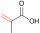  | 79-41-4 | Methacrylic acid |
|  | 97-63-2 | Ethyl methacrylate |
|  | 97-88-1 | Butyl methacrylate |
|  | 97-86-9 | Isobutyl methacrylate |
|  | 585-07-9 | *tert*-Butyl methacrylate
|  | 37674-57-0 | (3-Ethyloxetan-3-yl)methyl methacrylate | 
| 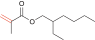 | 688-84-6 | 2-Ethylhexyl methacrylate |
|  | 142-90-5 | Dodecyl methacrylate |
|  | 32360-05-7 | Stearyl methacrylate |
| 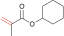 | 101-43-9 | Cyclohexyl methacrylate |
| 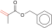 | 2495-37-6 | Benzyl methacrylate |
|  | 868-77-9 | 2-Hydroxyethyl methacrylate |
|  | 923-26-2 | 2-Hydroxypropyl methacrylate |
|  | 115372-36-6 | 3-Hydroxy-1-methacryloyloxyadamantane |
| 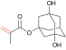 | 115522-15-1 | 3,5-Dihydroxy-1-adamantyl methacrylate |
|  | 2867-47-2 |
| 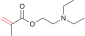 | 105-16-8 |
| 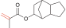 | 34759-34-7 |
| 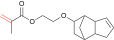 | 68586-19-6 |
| 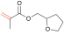 | 2455-24-5 |
| 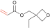 | 41988-14-1 |
|  | 2628-16-2 |
|  | 79-06-1 |
|  | 15214-89-8 |
|  | 79-10-7 |
|  | 96-33-3 |
|  | 93841-48-6 |
|  | 51952-49-9 |
|  | 5888-33-5 |
|  | 106-63-8 |
|  | 2499-59-4 |
|  | 216581-76-9 |
|  | 2478-10-6 |
|  | 86273-46-3 |
|  | 1663-39-4 |
| 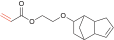 | 65983-31-5 |
|  | 3121-61-7 |
|  | 2156-97-0 |
|  | 32002-24-7 |
|  | 23117-36-4 |
|  | 4813-57-4 |
| 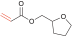 | 2399-48-6 |
|  | 818-61-1 |
| 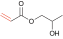 | 999-61-1 |
|  | 119692-59-0 |
| 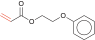 | 48145-04-6 |