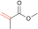

# CopDDB
This open source repository provides "Copolymer Descriptor Database (CopDDB)". This database includes parameter sets for radical-monomer pairs, which are applicable to the descriptors of copolymers. Details of each descriptor and applications to polymer informatics can be found in our preprint at [ChemRxiv].

[ChemRxiv]: https://chemrxiv.org/engage/chemrxiv/article-details/66b845265101a2ffa8f356cd

## Dataset
The dataset is available as a [csv](./copddb/datasets/data/PropagationQuantumChem_2023-12-13.csv) file, which includes the following descriptors.

|Descriptor name|Description|
| --- | --- |
| Radical | SMILES for a radical (M<sub>1</sub>*) |
| Monomer | SMILES for a monomer (M<sub>2</sub>) |
| DE_tail | Reaction energy for the addition of a model initiator radical (Me*) to M<sub>1</sub> at the tail position |
| DE_head | Reaction energy for the addition of a model initiator radical (Me*) to M<sub>1</sub> at the head position, which affords M<sub>1</sub>* |
| DE_precursor | Relative energy of the precurser from the dissociation limit (M<sub>1</sub>* and M<sub>2</sub>) |
| DE_TS | Relative energy of the TS of C-C bond formation from the dissociation limit (M<sub>1</sub>* and M<sub>2</sub>) |
| DE_product | Relative energy of the product from the dissociation limit (M<sub>1</sub>* and M<sub>2</sub>) |
| DE_barrier |  Activation barrier for the C-C bond formation (<I>i.e.</I>, the energy difference between the precursor and the TS) |
| DE_reaction | Reaction energy for the C-C bond formation (<I>i.e.</I>, the energy difference between the precursor and the product) |
| E_Rad_SOMO | SOMO energy of M<sub>1</sub>* |
| E_Rad_LUMO | LUMO energy of M<sub>1</sub>* |
| E_Mon_HOMO | HOMO energy of M<sub>2</sub> |
| E_Mon_LUMO | LUMO energy of M<sub>2</sub> |
| DE_SHgap | Energy difference between SOMO of M<sub>1</sub>* and HOMO of M<sub>2</sub> |
| DE_SLgap | Energy difference between SOMO of M<sub>1</sub>* and LUMO of M<sub>2</sub> |
| VBur_R228_Rad | %<I>V</I><sub>Bur</sub> within 2.28 Å of the reactive carbon atom of M<sub>1</sub>* |
| VBur_R350_Rad | %<I>V</I><sub>Bur</sub> within 3.50 Å of the reactive carbon atom of M<sub>1</sub>* |
| VBur_R228_Mon | %<I>V</I><sub>Bur</sub> within 2.28 Å of the reactive carbon atom of M<sub>2</sub> |
| VBur_R350_Mon | %<I>V</I><sub>Bur</sub> within 3.50 Å of the reactive carbon atom of M<sub>2</sub> |
| Volume_Rad | Volume of M<sub>1</sub>* |
| Volume_Mon | Volume of M<sub>2</sub> |
| CCdist_TS | Reactive C-C bond distance at the TS structure |
| Dihedral_TS | Dihedral angle around the reactive C-C at the TS structure |
| Sum_MW | Sum of molecular weights of M<sub>1</sub>* and M<sub>2</sub> |
| logP_Rad | Partition coefficient log<I>P</I> of M<sub>1</sub>* |
| logP_Mon | Partition coefficient log<I>P</I> of M<sub>2</sub> |

List of monomers.
| ID | Monomer | CAS RN | Name | Abbreviation |
| --- | --- | --- | --- | --- |
|  0 |  | 80-62-6 | Methyl methacrylate | MMA |
|  1 |  | 106-91-2 | Glycidyl methacrylate | GMA |
|  2 |  | 100-42-5 | Styrene | St |
|  3 |  | 5739-81-1 | Methyl (*Z*)-3-methoxyacrylate |
|  4 |   | 79-41-4 | Methacrylic acid |
|  5 |  | 97-63-2 | Ethyl methacrylate |
|  6 |  | 97-88-1 | Butyl methacrylate |
|  7 |  | 97-86-9 | Isobutyl methacrylate |
|  8 |  | 585-07-9 | *tert*-Butyl methacrylate
|  9 |  | 37674-57-0 | (3-Ethyloxetan-3-yl)methyl methacrylate | 
| 10 |  | 688-84-6 | 2-Ethylhexyl methacrylate |
| 11 |  | 142-90-5 | Dodecyl methacrylate |
| 12 |  | 32360-05-7 | Stearyl methacrylate |
| 13 |  | 101-43-9 | Cyclohexyl methacrylate | CHMA |
| 14 |  | 2495-37-6 | Benzyl methacrylate |
| 15 |  | 868-77-9 | 2-Hydroxyethyl methacrylate |
| 16 |  | 923-26-2 | 2-Hydroxypropyl methacrylate |
| 17 |  | 115372-36-6 | 3-Hydroxy-1-methacryloyloxyadamantane |
| 18 |  | 115522-15-1 | 3,5-Dihydroxy-1-adamantyl methacrylate |
| 19 |  | 2867-47-2 | 2-(Dimethylamino)ethyl methacrylate |
| 20 |  | 105-16-8 | (2-Diethylamino)ethyl methacrylate |
| 21 |  | 34759-34-7 | Dicyclopentanyl methacrylate |
| 22 |  | 68586-19-6 | Dicyclopentenyloxyethyl methacrylate |
| 23 |  | 2455-24-5 | Tetrahydrofurfuryl methacrylate | THFMA |
| 24 |  | 41988-14-1 | (3-Ethyloxetan-3-yl)methyl acrylate |
| 25 |  | 2628-16-2 | 4-Acetoxystyrene | PACS |
| 26 |  | 79-06-1 | Acrylamide |
| 27 |  | 15214-89-8 | (1,1-Dimethyl-2-sulfoethyl)acrylamide |
| 28 |  | 79-10-7 | Acrylic acid |
| 29 |  | 96-33-3 | Methyl acrylate |
| 30 |  | 93841-48-6 | Isooctadecyl acrylate |
| 31 |  | 51952-49-9 | Isononyl acrylate |
| 32 |  | 5888-33-5 | Isobornyl acrylate |
| 33 |  | 106-63-8 | Isobutyl acrylate |
| 34 |  | 2499-59-4 | *n*-Octyl acrylate |
| 35 |  | 216581-76-9 | 3-Hydroxy-1-adamantyl acrylate |
| 36 |  | 2478-10-6 | 4-Hydroxybutyl acrylate |
| 37 |  | 86273-46-3 | Vinyl ethoxyethyl acrylate |
| 38 |  | 1663-39-4 | *tert*-Butyl acrylate |
| 39 |  | 65983-31-5 | Dicyclopentenyloxyethyl acrylate |
| 40 |  | 3121-61-7 | 2-Methoxyethyl acrylate |
| 41 |  | 2156-97-0 | Dodecyl acrylate |
| 42 |  | 32002-24-7 | Ethyl 3,3-diethoxyacrylate |
| 43 |  | 23117-36-4 | 1,4-Cyclohexanedimethanol monoacrylate |
| 44 |  | 4813-57-4 | Stearyl acrylate |
| 45 |  | 2399-48-6 | Tetrahydrofurfuryl acrylate |
| 46 |  | 818-61-1 | 2-Hydroxyethyl acrylate |
| 47 |  | 999-61-1 | 2-Hydroxypropyl acrylate |
| 48 |  | 119692-59-0 | 4-(2,3-epoxypropoxy)butylacrylate |
| 49 |  | 48145-04-6 | 2-Hydroxypropyl acrylate |

## How to use
### Dependencies
CopDDB includes Python modules for reading and processing csv files. We confirmed that the code works with Python 3.10.12, numpy 1.25.2, pandas 1.5.3, and RDKit 2023.09.5. [A sample code](./sample_script/sample1.ipynb) worked on Google Colab is available.


### User installation
```sh
git clone https://github.com/hatanaka-lab/CopDDB
```

### Before Getting Descriptors
To obtain the list of SMILES of available monomers in CopDDB, use the `copddb.datasets.get_available_smiles()` function.
```python
>>> from CopDDB import copddb
>>> copddb.datasets.get_available_smiles()
['C=CC(=O)OC(C)(C)C', 'C=CC(=O)OCCCCCCCCCCCCCCCCCC', 'C=C(C)C(=O)OC12CC3CC(O)(CC(O)(C3)C1)C2', 'C=CC(=O)NC(C)(C)CS(=O)(=O)O', 'C=CC(=O)OC1C[C@@H]2CC[C@@]1(C)C2(C)C', 'C=C(C)C(=O)OC', 'C=CC(=O)OCC(C)O', 'C=C(C)C(=O)OC(C)(C)C', 'C=C(C)C(=O)OCC(C)C', 'C=C(C)C(=O)OCc1ccccc1', 'C=C(C)C(=O)O', 'C=C(C)C(=O)OCCCCCCCCCCCCCCCCCC', 'C=COCCOCCOC(=O)C=C', 'C=C(C)C(=O)OCCN(CC)CC', 'C=C(C)C(=O)OCC(CC)CCCC', 'C=C(C)C(=O)OCC(C)O', 'C=C(C)C(=O)OCCCC', 'C=CC(=O)OCCOC', 'C=CC(=O)OCC1(CC)COC1', 'C=CC(=O)OCCCCOCC1CO1', 'C=CC(=O)OCCOc1ccccc1', 'C=CC(=O)OCCCCCCC(C)C', 'C=Cc1ccc(OC(C)=O)cc1', 'C=CC(N)=O', 'C=C(C)C(=O)OC1CCCCC1', 'C=C(C)C(=O)OCCO', 'C=C(C)C(=O)O[C@@]12C[C@H]3C[C@@H](C1)C[C@](O)(C3)C2', 'C=CC(=O)OCCCCCCCCCCCC', 'C=C(C)C(=O)OCCCCCCCCCCCC', 'C=Cc1ccccc1', 'C=CC(=O)OCC1CCCO1', 'C=C(C)C(=O)OCC1(CC)COC1', 'C=C(C)C(=O)OC1CC2CC1C1CCCC21', 'C=C(C)C(=O)OCCOC1CC2CC1C1C=CCC21', 'C=CC(=O)OCC(C)C', 'C=C(C)C(=O)OCCN(C)C', 'C=C(C)C(=O)OCC', 'C=CC(=O)OCC1CCC(CO)CC1', 'C=C(C)C(=O)OCC1CO1', 'C=CC(=O)OCCOC1CC2CC1C1CC=CC21', 'C=CC(=O)O', 'C=CC(=O)OC', 'C=CC(=O)OCCO', 'CCOC(=O)C=C(OCC)OCC', 'C=CC(=O)OCCCCCCCCCCCCCCCC(C)C', 'C=CC(=O)OCCCCCCCC', 'C=C(C)C(=O)OCC1CCCO1', 'CO/C=C\\C(=O)OC', 'C=CC(=O)OCCCCO', 'C=CC(=O)O[C@@]12C[C@H]3C[C@@H](C1)C[C@](O)(C3)C2']
```

To obtain the names of descriptors registered in CopDDB, use the `copddb.datasets.get_available_descriptors()` function.
```python
>>> copddb.datasets.get_available_descriptors()
['Radical', 'Monomer', 'DE_decomposition_tail', 'DE_decomposition_head', 'DE_precursor', 'DE_TS', 'DE_product', 'DE_barrier', 'DE_reaction', 'E_Rad_SOMO', 'E_Rad_LUMO', 'E_Mon_HOMO', 'E_Mon_LUMO', 'DE_SHgap', 'DE_SLgap', 'VBur_R228_Mon', 'VBur_R350_Mon', 'VBur_R228_Rad', 'VBur_R350_Rad', 'Volume_MonteCarlo_Mon', 'Volume_MonteCarlo_Rad', 'CCdist_TS']
```

### Example 1: Getting descriptors of radical-monomer pairs.
The most basic usage is to get descriptors for a radical-monomer pair using the `copddb.datasets.descriptors_from_smiles()` function. The following example provides the descriptors in the form of a `pandas.DataFrame` from the SMILES of a radical `smi_rad` and a monomer `smi_mon`.

```python
from CopDDB import copddb

smi_rad = "C=CC(=O)OCCCCCCCCCCCC"
smi_mon = "C=CC(=O)O"

descriptor = copddb.datasets.descriptors_from_smiles(smi_rad, smi_mon)
```
The output of the descriptors is as follows.
```
>>> descriptor
      DE_decomposition_tail  DE_decomposition_head  ...  Volume_MonteCarlo_Rad  CCdist_TS
2078               0.042541               0.058434  ...                227.414   2.268076

[1 rows x 20 columns]
```

If you input SMILES that are not listed in CopDDB, an empty DataFrame will be returned. When you input ethylene `"C=C"`,
```python
>>> descriptor = copddb.datasets.descriptors_from_smiles("C=C", smi_mon)
```
The output of descriptors is as follows.
```python
>>> descriptor
Empty DataFrame
Columns: [DE_decomposition_tail, DE_decomposition_head, DE_precursor, DE_TS, DE_product, DE_barrier, DE_reaction, E_Rad_SOMO, E_Rad_LUMO, E_Mon_HOMO, E_Mon_LUMO, DE_SHgap, DE_SLgap, VBur_R228_Mon, VBur_R350_Mon, VBur_R228_Rad, VBur_R350_Rad, Volume_MonteCarlo_Mon, Volume_MonteCarlo_Rad, CCdist_TS]
Index: []
```

If you want to explicitly include missing values, use the `with_nan` option (which is `False` by default) as follows.
```python
descriptor = copddb.datasets.descriptors_from_smiles("C=C", smi_mon, with_nan=True)
```
The output of descriptors is as follows.
```python
descriptor
      DE_decomposition_tail  DE_decomposition_head  ...  Volume_MonteCarlo_Rad  CCdist_TS
2500                    NaN                    NaN  ...                    NaN        NaN

[1 rows x 20 columns]
```

To include the input SMILES in the returned value, use the `with_smiles` option (which is `False` by default).
```python
descriptor = copddb.datasets.descriptors_from_smiles("C=C", smi_mon, with_nan=True, with_smiles=True)
```
The output of descriptors is as follows.
```python
>>> descriptor
     Radical    Monomer  ...  Volume_MonteCarlo_Rad  CCdist_TS
2500     C=C  C=CC(=O)O  ...                    NaN        NaN

[1 rows x 22 columns]
```

When you need to input Multiple radical-monomer pairs, use a `list` type as follows.
```python
smi_list = [
    ["C=C(C)C(=O)OC", "C=C(C)C(=O)OC"],
    ["C=C(C)C(=O)OC", "C=CC(=O)O"],
    ["CO/C=C\C(=O)OC", "C=Cc1ccccc1"]
]

descriptors = copddb.datasets.descriptors_from_smiles(smi_list)
```
The output of descriptors is as follows.
```python
>>> descriptors
     DE_decomposition_tail  DE_decomposition_head  ...  Volume_MonteCarlo_Rad  CCdist_TS
0                 0.038534               0.061518  ...               103.2494   2.254882
28                0.038534               0.061518  ...               103.2494   2.248237
152               0.045085               0.045173  ...               103.2451   2.409667

[3 rows x 20 columns]
```

### Example 2: Creating a Dataset from a List of SMILES and a List of Target Variables
When you have radical-monomer pairs and their corresponding target variables, use the `copddb.datasets.build_dataset_from_smiles_and_y()` function to create a dataset including both descriptors and target variables. The function is useful for removing missing values in descriptors. The resulting dataset is returned as a `Bunch` object.

```python
from CopDDB import copddb
smi_list = [
    ["C=C(C)C(=O)OC", "C=C(C)C(=O)OC"],
    ["C=C(C)C(=O)OC", "C=CC(=O)O"],
    ["CO/C=C\C(=O)OC", "C=Cc1ccccc1"],
    ["C=C", "C=C"] # SMILES that result in missing values
]

target = [1, 2, 3, 4] # Target variables

new_dataset = copddb.datasets.build_dataset_from_smiles_and_y(smi_list, target)
```
The created `Bunch` object `new_dataset` contains the descriptors `data` and the target variables `target` as follows. 
```python
>>> new_dataset.keys()
dict_keys(['data', 'target'])

>>> new_dataset["data"]
     DE_decomposition_tail  DE_decomposition_head  ...  Volume_MonteCarlo_Rad  CCdist_TS
0                 0.038534               0.061518  ...               103.2494   2.254882
28                0.038534               0.061518  ...               103.2494   2.248237
152               0.045085               0.045173  ...               103.2451   2.409667

[3 rows x 20 columns]

>>> new_dataset["target"]
array([1, 2, 3])
```

As shown in Example 1, you have the option to explicitly handle missing values by using the `with_nan` parameter, which is set to `False` by default.
```python
>>> new_dataset = copddb.datasets.build_dataset_from_smiles_and_y(smi_list, target, with_nan=True)

>>> new_dataset["data"]
      DE_decomposition_tail  DE_decomposition_head  ...  Volume_MonteCarlo_Rad  CCdist_TS
0                  0.038534               0.061518  ...               103.2494   2.254882
28                 0.038534               0.061518  ...               103.2494   2.248237
152                0.045085               0.045173  ...               103.2451   2.409667
2501                    NaN                    NaN  ...                    NaN        NaN

[4 rows x 20 columns]

>>> new_dataset["target"]
array([1, 2, 3, 4])
```

### Example 3: Converting Parameters of Radical-Monomer Pairs to Descriptors of Monomer Pairs (Part I)
To apply the descriptors of radical-monomer pairs to build a ML model for copolymers, preprocessing of the discriptors is required. 
When focusing on the reactivity ratio $r_1$, which is the ratio between the kinetic constants of the reactions in eqs. (1) and (2), <I>i.e.</I>, $k$<sub>11</sub> and $k$<sub>12</sub>, the descriptors of (M<sub>1</sub>\*, M<sub>1</sub>) and (M<sub>1</sub>\*, M<sub>2</sub>) could be appropriate for input of monomer pairs of copolymers. 

$$
M_1^* + M_1 \xrightarrow{k_{11}} M_1^* ~~~~(1)
$$

$$
M_1^* + M_2 \xrightarrow{k_{12}} M_2^* ~~~~(2)
$$

To combine the descriptors of these two radical-monomer pairs, use the `m1m2list_to_11_12()` function. With this function, the label of corresponding radical or monomer (1 or 2) is added to the tail of each descriptor name. 
(For example, E_Rad_SOMO of M1* and E_TS of (M<sub>1</sub>*, M<sub>2</sub>) pair are converted to E_Rad_SOMO_1 and E_TS_12, respectively.) 

```python
from CopDDB import copddb
smi_list = [
    ["C=C(C)C(=O)OC", "C=C(C)C(=O)OC"],
    ["C=C(C)C(=O)OC", "C=CC(=O)O"],
    ["CO/C=C\C(=O)OC", "C=Cc1ccccc1"]
]

new_descriptors = copddb.datasets.m1m2list_to_11_12(smi_list)
```

The dataset of descriptors and objective variable can be also prepared with `build_11_12_variables_from_smiles_and_y()` function as follows.

```python
smi_list = [
    ["C=C(C)C(=O)OC", "C=C(C)C(=O)OC"],
    ["C=C(C)C(=O)OC", "C=CC(=O)O"],
    ["CO/C=C\C(=O)OC", "C=Cc1ccccc1"],
    ["C=C", "C=C"] # SMILES that result in missing values
]

target = [1, 2, 3, 4] # Target variables

new_dataset = copddb.datasets.build_11_12_variables_from_smiles_and_y(smi_list, target)
```
The contents of the new_dataset is as follows.
```python
>>> new_dataset["data"]
   DE_TS_11  DE_TS_12  ...  Volume_MonteCarlo_Rad_1  Volume_MonteCarlo_Rad_2
0 -0.005547 -0.005547  ...                 103.2494                 103.2494
1 -0.005547  0.008555  ...                 103.2494                  68.5728
2 -0.001421 -0.003731  ...                 103.2451                 108.9815

[3 rows x 40 columns]

>>> new_dataset["data"].keys()
Index(['DE_TS_11', 'DE_TS_12', 'DE_product_11', 'DE_product_12',
       'DE_barrier_11', 'DE_barrier_12', 'DE_reaction_11', 'DE_reaction_12',
       'DE_SHgap_11', 'DE_SHgap_12', 'DE_SLgap_11', 'DE_SLgap_12',
       'CCdist_TS_11', 'CCdist_TS_12', 'DE_decomposition_tail_1',
       'DE_decomposition_tail_2', 'DE_decomposition_head_1',
       'DE_decomposition_head_2', 'DE_precursor_1', 'DE_precursor_2',
       'E_Rad_SOMO_1', 'E_Rad_SOMO_2', 'E_Rad_LUMO_1', 'E_Rad_LUMO_2',
       'E_Mon_HOMO_1', 'E_Mon_HOMO_2', 'E_Mon_LUMO_1', 'E_Mon_LUMO_2',
       'VBur_R228_Mon_1', 'VBur_R228_Mon_2', 'VBur_R350_Mon_1',
       'VBur_R350_Mon_2', 'VBur_R228_Rad_1', 'VBur_R228_Rad_2',
       'VBur_R350_Rad_1', 'VBur_R350_Rad_2', 'Volume_MonteCarlo_Mon_1',
       'Volume_MonteCarlo_Mon_2', 'Volume_MonteCarlo_Rad_1',
       'Volume_MonteCarlo_Rad_2'],
      dtype='object')
```

### Example 4: Converting Parameters of Radical-Monomer Pairs to Descriptors of Monomer Pairs (Part II)
When focusing on the copolymers consisting of two monomers, M<sub>1</sub> (= St, GMA, PACS, THFMA, and CHMA) and M<sub>2</sub> (= MMA) for instance, the descriptors of three radical-monomer pairs, (M<sub>1</sub>\*, M<sub>1</sub>), (M<sub>1</sub>\*, MMA), (MMA\*, M<sub>1</sub>) could be used for the descriptos of the monomer pair of M<sub>1</sub> and MMA. These three descriptor sets can be formed by the `m1list_and_m2_to_11_12_21()` function as follows.

```py
from CopDDB import copddb
m1list = [
    "C=Cc1ccccc1", # St
    "C=C(C)C(=O)OCC1CO1", # GMA
    "C=Cc1ccc(OC(C)=O)cc1", # PACS
    "C=C(C)C(=O)OCC1CCCO1", # THFMA
    "C=C(C)C(=O)OC1CCCCC1", # CHMA
]

m2 = "C=C(C)C(=O)OC" # MMA

new_dataset = copddb.datasets.m1list_and_m2_to_11_12_21(m1list, m2)
```

The contents of the new_dataset is as follows.

```
>>> new_dataset.keys()
dict_keys(['data', 'm1s', 'm2'])

>>> new_dataset.data
   DE_tail_11  DE_tail_12  DE_tail_21  DE_head_11  DE_head_12  DE_head_21  ...  logP_Rad_11  logP_Rad_12  logP_Rad_21  logP_Mon_11  logP_Mon_12  logP_Mon_21
0    0.038749    0.038749    0.038534    0.063061    0.063061    0.061518  ...          2.7          2.7          1.0          2.7          1.0          2.7
1    0.038719    0.038719    0.038534    0.062134    0.062134    0.061518  ...          0.6          0.6          1.0          0.6          1.0          0.6
2    0.038493    0.038493    0.038534    0.063246    0.063246    0.061518  ...          2.3          2.3          1.0          2.3          1.0          2.3
3    0.037938    0.037938    0.038534    0.061257    0.061257    0.061518  ...          1.1          1.1          1.0          1.1          1.0          1.1
4    0.039386    0.039386    0.038534    0.061804    0.061804    0.061518  ...          2.5          2.5          1.0          2.5          1.0          2.5

[5 rows x 72 columns]

>>> new_dataset.m1s
['C=Cc1ccccc1', 'C=C(C)C(=O)OCC1CO1', 'C=Cc1ccc(OC(C)=O)cc1', 'C=C(C)C(=O)OCC1CCCO1', 'C=C(C)C(=O)OC1CCCCC1']

>>> new_dataset.m2
'C=C(C)C(=O)OC'
```
