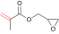

[README in Japanese](./README_jp.md)

# CopDDB

## Overview
This repository has been created to distribute a dataset that collects various descriptors related to the propagation of polymers, obtained from quantum chemical calculations. It is intended to be useful to the polymer chemistry and computer science communities.

## Contents of CopDDB
The dataset is provided in [csv](./copddb/datasets/data/PropagationQuantumChem_2023-12-13.csv) format and contains a variety of descriptors for chemical reactions. The descriptors include in the dataset are as follows.

|Descriptor name|Description|
| --- | --- |
| Radical | SMILES for radical molecules. |
| Monomer | SMILES for monomer molecules. |
| ... | ... |

List of collected molecules.
| Monomer | CAS RN | Name | Abbreviation |
| --- | --- | --- | --- |
|  | 80-62-6 | Methyl methacrylate | MMA |
|  | 106-91-2 | Glycidyl methacrylate | GMA |
|  | 100-42-5 | Styrene | St |
|  | 5739-81-1 | Methyl (*Z*)-3-methoxyacrylate |
|   | 79-41-4 | Methacrylic acid |
|  | 97-63-2 | Ethyl methacrylate |
|  | 97-88-1 | Butyl methacrylate |
|  | 97-86-9 | Isobutyl methacrylate |
|  | 585-07-9 | *tert*-Butyl methacrylate
|  | 37674-57-0 | (3-Ethyloxetan-3-yl)methyl methacrylate | 
|  | 688-84-6 | 2-Ethylhexyl methacrylate |
|  | 142-90-5 | Dodecyl methacrylate |
|  | 32360-05-7 | Stearyl methacrylate |
|  | 101-43-9 | Cyclohexyl methacrylate |
|  | 2495-37-6 | Benzyl methacrylate |
|  | 868-77-9 | 2-Hydroxyethyl methacrylate |
|  | 923-26-2 | 2-Hydroxypropyl methacrylate |
|  | 115372-36-6 | 3-Hydroxy-1-methacryloyloxyadamantane |
|  | 115522-15-1 | 3,5-Dihydroxy-1-adamantyl methacrylate |
|  | 2867-47-2 |
|  | 105-16-8 |
|  | 34759-34-7 |
|  | 68586-19-6 |
|  | 2455-24-5 |
|  | 41988-14-1 |
|  | 2628-16-2 |
|  | 79-06-1 |
|  | 15214-89-8 |
|  | 79-10-7 |
|  | 96-33-3 |
|  | 93841-48-6 |
|  | 51952-49-9 |
|  | 5888-33-5 |
|  | 106-63-8 |
|  | 2499-59-4 |
|  | 216581-76-9 |
|  | 2478-10-6 |
|  | 86273-46-3 |
|  | 1663-39-4 |
|  | 65983-31-5 |
|  | 3121-61-7 |
|  | 2156-97-0 |
|  | 32002-24-7 |
|  | 23117-36-4 |
|  | 4813-57-4 |
|  | 2399-48-6 |
|  | 818-61-1 |
|  | 999-61-1 |
|  | 119692-59-0 |
|  | 48145-04-6 |

## Installation
### Dependencies
CopDDB requirs
- Python 3
- NumPy
- RDKit

This repository includes Python modules for loading and processing CSV files. By utilizing these modules in a Python environment, you can easily manipulate and analyze the dataset.

### User installation
```sh
git clone https://github.com/hatanaka-lab/CopDDB
```

### Example 1: Obraining descriptors using SMILES strings.
The most basic usage is to retrieve descriptors collected for propagation reactions using the dataset.`QCValuesFromSMILES()` function. The following example demonstrates how to obtain descriptors in the form of a `pandas.DataFrame` using the SMILES for radical `smi_rad` and the SMILES for monomer `smi_mon`.

```python
from CopDDB import datasets

smi_rad = "C=CC(=O)OCCCCCCCCCCCC"
smi_mon = "C=CC(=O)O"

features = datasets.QCValuesFromSMILES(smi_rad, smi_mon)
```
The output of features is as follows.
```
>>> print(features)
      DE_decomposition_tail  DE_decomposition_head  DE_precursor    DE_TS  ...  Real_theta  Volume_MonteCarlo_Mon  Volume_MonteCarlo_Rad  CCdist_TS
2078               0.042541               0.058434     -0.012791 -0.00314  ...   97.457318                54.3487                227.414   2.268076

[1 rows x 26 columns]
```

If you input SMILES that are not listed in the CopDDB, an empty DataFrame will be returned. Let's try this with the ethene molecule `"C=C"`
```python
features = datasets.QCValuesFromSMILES("C=C", smi_mon)
```
The output of features is as follows.
```python
>>> print(features)
Empty DataFrame
Columns: [DE_decomposition_tail, DE_decomposition_head, DE_precursor, DE_TS, DE_product, DE_barrier, DE_reaction, DG_precursor, DG_TS, DG_product, DG_barrier, DG_reaction, E_Rad_SOMO, E_Rad_LUMO, E_Mon_HOMO, E_Mon_LUMO, DE_SHgap, DE_SLgap, VBur_R228_Mon, VBur_R350_Mon, VBur_R228_Rad, VBur_R350_Rad, Real_theta, Volume_MonteCarlo_Mon, Volume_MonteCarlo_Rad, CCdist_TS]
Index: []
```

If you want to explicitly include missing values, use the `with_nan` option (which is `False` by default) as follows.
```python
features = datasets.QCValuesFromSMILES("C=C", smi_mon, with_nan=True)
```
The output of features is as follows.
```python
>>> print(features)
      DE_decomposition_tail  DE_decomposition_head  DE_precursor  DE_TS  ...  Real_theta  Volume_MonteCarlo_Mon  Volume_MonteCarlo_Rad  CCdist_TS
2500                    NaN                    NaN           NaN    NaN  ...         NaN                    NaN                    NaN        NaN

[1 rows x 26 columns]
```

To include the input SMILES in the returned value, use the `with_smiles` option (which is `False` by default).
```python
features = datasets.QCValuesFromSMILES("C=C", smi_mon, with_nan=True, with_smiles=True)
```
The output of features is as follows.
```python
>>> print(features)
     Radical    Monomer  DE_decomposition_tail  DE_decomposition_head  ...  Real_theta  Volume_MonteCarlo_Mon  Volume_MonteCarlo_Rad  CCdist_TS
2500     C=C  C=CC(=O)O                    NaN                    NaN  ...         NaN                    NaN                    NaN        NaN

[1 rows x 28 columns]
```

SMILES can also be input as a `list` type. By using a `list`, you can obtain multiple descriptors at the same time. For example, you can use it as follows.
```python
smi_list = [
    ["C=C(C)C(=O)OC", "C=C(C)C(=O)OC"],
    ["C=C(C)C(=O)OC", "C=CC(=O)O"],
    ["CO/C=C\C(=O)OC", "C=Cc1ccccc1"]
]

features = datasets.QCValuesFromSMILES(smi_list)
```
The output of features is as follows.
```python
>>> print(features)
     DE_decomposition_tail  DE_decomposition_head  DE_precursor     DE_TS  ...  Real_theta  Volume_MonteCarlo_Mon  Volume_MonteCarlo_Rad  CCdist_TS
0                 0.038534               0.061518     -0.017766 -0.005547  ...  257.946990                79.4279               103.2494   2.254882
28                0.038534               0.061518     -0.004842  0.008555  ...   41.350879                54.3487               103.2494   2.248237
152               0.045085               0.045173     -0.014617 -0.003731  ...   33.562987                89.4457               103.2451   2.409667

[3 rows x 26 columns]
```

### Example 2: Creating a Dataset from a List of SMILES and a List of Target Variables (Preprocessing)
In this example, we use the `datasets.buildVariablesFromSMILESandY()` function to create a dataset from SMILES strings and target variables, including both descriptors and target variables. This function is useful for removing missing values in descriptors. The resulting dataset is returned as a Bunch object.

```python 
from CopDDB import datasets

smi_list = [
    ["C=C(C)C(=O)OC", "C=C(C)C(=O)OC"],
    ["C=C(C)C(=O)OC", "C=CC(=O)O"],
    ["CO/C=C\C(=O)OC", "C=Cc1ccccc1"],
    ["C=C", "C=C"] # SMILES that result in missing values
]

target = [1, 2, 3, 4] # Target variables

ds = datasets.buildVariablesFromSMILESandY(smi_list, target)
```
The `Bunch` object created contains descriptors `data` and target variables `target`. If you examine the contents of each, you will find the following.
```python
>>> ds.keys()
dict_keys(['data', 'target'])

>>> print(ds["data"])
     DE_decomposition_tail  DE_decomposition_head  DE_precursor     DE_TS  ...  Real_theta  Volume_MonteCarlo_Mon  Volume_MonteCarlo_Rad  CCdist_TS
0                 0.038534               0.061518     -0.017766 -0.005547  ...  257.946990                79.4279               103.2494   2.254882
28                0.038534               0.061518     -0.004842  0.008555  ...   41.350879                54.3487               103.2494   2.248237
152               0.045085               0.045173     -0.014617 -0.003731  ...   33.562987                89.4457               103.2451   2.409667

[3 rows x 26 columns]

>>> print(ds["target"])
[1 2 3]
```

Similar to Example 1, if you want to explicitly include missing values, you can use the `with_nan` option (which is `False` by default).
```python
>>> ds = datasets.buildVariablesFromSMILESandY(smi_list, target, with_nan=True)

>>> print(ds["data"])
      DE_decomposition_tail  DE_decomposition_head  DE_precursor     DE_TS  ...  Real_theta  Volume_MonteCarlo_Mon  Volume_MonteCarlo_Rad  CCdist_TS
0                  0.038534               0.061518     -0.017766 -0.005547  ...  257.946990                79.4279               103.2494   2.254882
28                 0.038534               0.061518     -0.004842  0.008555  ...   41.350879                54.3487               103.2494   2.248237
152                0.045085               0.045173     -0.014617 -0.003731  ...   33.562987                89.4457               103.2451   2.409667
2500                    NaN                    NaN           NaN       NaN  ...         NaN                    NaN                    NaN        NaN

[4 rows x 26 columns]

>>> print(ds["target"])
[1 2 3 4]
```

### Example 3: Creating a Descriptor for Monomer Pairs (Preprocessing)
In this example, we will explain the method of creating descriptors for a copolymer made of two different monomers, $M_1$ and $M_2$. This is done using the `datasets.buildPairVariablesFromSMILESandY()` function. This function combines descriptors related to the follow ing equations 1 and 2 to create a new set of descriptors.

First, let's consider why it is necessary to create a new set of descriptors. The growth reaction of the copolymer formed by $M_1$ and $M_2$ involves the following four basic reactions.

$$
M_1^* + M_1 \xrightarrow{k_{11}} M_1^* ~~~~(1)
$$

$$
M_1^* + M_2 \xrightarrow{k_{12}} M_2^* ~~~~(2)
$$

$$
M_2^* + M_1 \xrightarrow{k_{21}} M_1^* ~~~~(3)
$$

$$
M_2^* + M_2 \xrightarrow{k_{22}} M_2^* ~~~~(4)
$$

Here, $M_1^*$ and $M_2^*$ represent the radicals of $M_1$ and $M_2$ respectively, and $k_{ij}$ denotes the reaction rate constants between $M_i^*$ and $M_j$. A single record in CopDDB [ref1] contains information about one of the reactions from equations 1 to 4. This means that to better explain the reactions between monomers $M_1$ and $M_2$, it is more effective to use multiple equations from the four basic reactions.

The `datasets.buildPairVariablesFromSMILESandY()` function in CopDDB appends the pair numbers of the molecules involved in the reaction to the end of the descriptors, creating new descriptors. For example, for equations 1 and 2, the descriptor `DE_TS` becomes `DE_TS_11` and `DE_TS_12` respectively. For descriptors derived from a single molecule like the radical $M_1^*$ or the monomer $M_i$, only single number is appended. For instance, a molecular orbital energy descriptor like `E_Rad_SOMO` becomes `E_Rad_SOMO_1`.

Based on this idea, [ref1] rearranged the descriptors in CopDDB to create a set of descriptors and used them to build a predictive model for the copolymerization monomer reactivity ratio $r_1$.

[ref1]: https://www.rsc.org/journals-books-databases/about-journals/digital-discovery/
