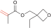
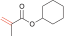
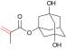
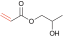
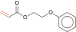

[README in English](./README.md)  

# CopDDB

## 概要
このリポジトリは、量子化学計算によって得られたポリマーの成長反応に関するさまざまな記述子を集めたデータセットを配布するために作成されました。ポリマーに関する化学・情報科学コミュニティに役立つことを目指しています。

## データベースの内容
データセットは csv 形式で提供されており、成長反応に関する多様な記述子を含んでいます。([csv](./copddb/datasets/data/PropagationQuantumChem_2023-12-13.csv)) 以降「CopDDB」と呼びます。
CopDDB に含まれる記述子は以下の通りです。

|記述子名|説明|
| --- | --- |
| Radical | ラジカル分子に対応する SMILES |
| Monomer | モノマー分子の対応する SMILES |
| DE_decomposition_tail | モノマーの tail 位からメチル基を取り除くのに必要なエネルギー |
| DE_decomposition_head | モノマーの head 位からメチル基を取り除くのに必要なエネルギー |
| DE_precursor | TS から IRC を前駆体方向に降りた点の相対的な全電子エネルギー |
| DE_TS | TS の相対全電子エネルギー |
| DE_product | 生成物の相対的な全電子エネルギー |
| DE_barrier | 前駆体と TS のエネルギー差 |
| DE_reaction | 反応エネルギー |
| E_Rad_SOMO | ラジカルの SOMO のエネルギー |
| E_Rad_LUMO | ラジカルの LUMO のエネルギー |
| E_Mon_HOMO | モノマーの HOMO のエネルギー |
| E_Mon_LUMO | モノマーの LUMO のエネルギー |
| DE_SHgap | ラジカルの SOMO とモノマーの HOMO のエネルギー差 |
| DE_SLgap | ラジカルの SOMO とモノマーの LUMO のエネルギー差 |
| VBur_R228_Mon | モノマーの反応点 から 2.28 Å 以内の $\%V_{Bur}$ |
| VBur_R350_Mon | モノマーの反応点 から 3.50 Å 以内の $\%V_{Bur}$ |
| VBur_R228_Rad | ラジカルの反応点 から 2.28 Å 以内の $\%V_{Bur}$ |
| VBur_R350_Rad | ラジカルの反応点 から 3.50 Å 以内の $\%V_{Bur}$ |
| Volume_MonteCarlo_Mon | モノマーの体積 |
| Volume_MonteCarlo_Rad | ラジカルの体積 |
| CCdist_TS | TS 構造内の C–C 距離 |

収集対象分子は以下の通りです。
| Monomer | CAS RN | Name | Abbreviation |
| --- | --- | --- | --- |
|  | 80-62-6 | Methyl methacrylate | MMA |
|  | 106-91-2 | Glycidyl methacrylate | GMA |
|  | 100-42-5 | Styrene | St |
|  | 5739-81-1 | Methyl (*Z*)-3-methoxyacrylate |
|   | 79-41-4 | Methacrylic acid |
|  | 97-63-2 | Ethyl methacrylate |
|  | 97-88-1 | Butyl methacrylate |
|  | 97-86-9 | Isobutyl methacrylate |
|  | 585-07-9 | *tert*-Butyl methacrylate
|  | 37674-57-0 | (3-Ethyloxetan-3-yl)methyl methacrylate | 
|  | 688-84-6 | 2-Ethylhexyl methacrylate |
|  | 142-90-5 | Dodecyl methacrylate |
|  | 32360-05-7 | Stearyl methacrylate |
|  | 101-43-9 | Cyclohexyl methacrylate |
|  | 2495-37-6 | Benzyl methacrylate |
|  | 868-77-9 | 2-Hydroxyethyl methacrylate |
|  | 923-26-2 | 2-Hydroxypropyl methacrylate |
|  | 115372-36-6 | 3-Hydroxy-1-methacryloyloxyadamantane |
|  | 115522-15-1 | 3,5-Dihydroxy-1-adamantyl methacrylate |
|  | 2867-47-2 | (2-Dimethylaminoethyl) methacrylate ! |
|  | 105-16-8 | (2-Diethylamino)ethyl methacrylate ! |
|  | 34759-34-7 | Dicyclopentanyl methacrylate ! |
|  | 68586-19-6 | Ethylene glycol dicyclopentenyl ether methacrylate ! |
|  | 2455-24-5 | Tetrahydrofurfuryl methacrylate ! |
|  | 41988-14-1 | (3-Ethyloxetan-3-yl)methyl acrylate ! |
|  | 2628-16-2 | 4-Vinylphenyl acetate ! |
|  | 79-06-1 | Acrylamide ! |
|  | 15214-89-8 | 2-Acrylamido-2-methylpropanesulfonic acid ! |
|  | 79-10-7 | Acrylic acid ! |
|  | 96-33-3 | Methyl acrylate ! |
|  | 93841-48-6 | Isooctadecyl acrylate ! |
|  | 51952-49-9 | Isononyl acrylate ! |
|  | 5888-33-5 | Isobornyl acrylate ! |
|  | 106-63-8 | Isobutyl acrylate ! |
|  | 2499-59-4 | *n*-Octyl acrylate ! |
|  | 216581-76-9 | 3-Hydroxy-1-adamantyl acrylate ! |
|  | 2478-10-6 | 4-Hydroxybutyl acrylate ! |
|  | 86273-46-3 | 2-(2-Vinyloxyethoxy)ethyl acrylate ! |
|  | 1663-39-4 | *tert*-Butyl acrylate ! |
|  | 65983-31-5 | Dicyclopentenyloxyethyl acrylate ! |
|  | 3121-61-7 | 2-Methoxyethyl acrylate ! |
|  | 2156-97-0 | Dodecyl acrylate ! |
|  | 32002-24-7 | Ethyl 3,3-diethoxyacrylate ! |
|  | 23117-36-4 | 1,4-Cyclohexanedimethanol monoacrylate ! |
|  | 4813-57-4 | Stearyl acrylate ! |
|  | 2399-48-6 | Tetrahydrofurfuryl acrylate ! |
|  | 818-61-1 | 2-Hydroxyethyl acrylate ! |
|  | 999-61-1 | 2-Hydroxypropyl acrylate ! |
|  | 119692-59-0 | 4-Hydroxybutyl acrylate ! |
|  | 48145-04-6 | 2-Phenoxyethyl acrylate ! |

## 利用方法
CopDDB は、csv ファイルの読み込みと処理を行うための Python モジュールも含まれています。Python 環境にて、このモジュールを利用することで、データセットを簡単に操作し分析を行うことができます。また、以下の外部ライブラリを用います。
- numpy
- pandas
- RDKit

### インストール方法
```sh
git clone https://github.com/hatanaka-lab/CopDDB
```

### 記述子の取得前に
CopDDB に登録された SMILES のリストを取得するには、`copddb.datasets.get_available_smiles()` 関数を用います。
```python
>>> copddb.datasets.get_available_smiles()
['C=CC(=O)OC(C)(C)C', 'C=CC(=O)OCCCCCCCCCCCCCCCCCC', 'C=C(C)C(=O)OC12CC3CC(O)(CC(O)(C3)C1)C2', 'C=CC(=O)NC(C)(C)CS(=O)(=O)O', 'C=CC(=O)OC1C[C@@H]2CC[C@@]1(C)C2(C)C', 'C=C(C)C(=O)OC', 'C=CC(=O)OCC(C)O', 'C=C(C)C(=O)OC(C)(C)C', 'C=C(C)C(=O)OCC(C)C', 'C=C(C)C(=O)OCc1ccccc1', 'C=C(C)C(=O)O', 'C=C(C)C(=O)OCCCCCCCCCCCCCCCCCC', 'C=COCCOCCOC(=O)C=C', 'C=C(C)C(=O)OCCN(CC)CC', 'C=C(C)C(=O)OCC(CC)CCCC', 'C=C(C)C(=O)OCC(C)O', 'C=C(C)C(=O)OCCCC', 'C=CC(=O)OCCOC', 'C=CC(=O)OCC1(CC)COC1', 'C=CC(=O)OCCCCOCC1CO1', 'C=CC(=O)OCCOc1ccccc1', 'C=CC(=O)OCCCCCCC(C)C', 'C=Cc1ccc(OC(C)=O)cc1', 'C=CC(N)=O', 'C=C(C)C(=O)OC1CCCCC1', 'C=C(C)C(=O)OCCO', 'C=C(C)C(=O)O[C@@]12C[C@H]3C[C@@H](C1)C[C@](O)(C3)C2', 'C=CC(=O)OCCCCCCCCCCCC', 'C=C(C)C(=O)OCCCCCCCCCCCC', 'C=Cc1ccccc1', 'C=CC(=O)OCC1CCCO1', 'C=C(C)C(=O)OCC1(CC)COC1', 'C=C(C)C(=O)OC1CC2CC1C1CCCC21', 'C=C(C)C(=O)OCCOC1CC2CC1C1C=CCC21', 'C=CC(=O)OCC(C)C', 'C=C(C)C(=O)OCCN(C)C', 'C=C(C)C(=O)OCC', 'C=CC(=O)OCC1CCC(CO)CC1', 'C=C(C)C(=O)OCC1CO1', 'C=CC(=O)OCCOC1CC2CC1C1CC=CC21', 'C=CC(=O)O', 'C=CC(=O)OC', 'C=CC(=O)OCCO', 'CCOC(=O)C=C(OCC)OCC', 'C=CC(=O)OCCCCCCCCCCCCCCCC(C)C', 'C=CC(=O)OCCCCCCCC', 'C=C(C)C(=O)OCC1CCCO1', 'CO/C=C\\C(=O)OC', 'C=CC(=O)OCCCCO', 'C=CC(=O)O[C@@]12C[C@H]3C[C@@H](C1)C[C@](O)(C3)C2']
```

CopDDB に登録された記述子名を取得するには、`copddb.datasets.get_available_descriptors()` 関数を用います。
```python
>>> copddb.datasets.get_available_descriptors()
['Radical', 'Monomer', 'DE_decomposition_tail', 'DE_decomposition_head', 'DE_precursor', 'DE_TS', 'DE_product', 'DE_barrier', 'DE_reaction', 'E_Rad_SOMO', 'E_Rad_LUMO', 'E_Mon_HOMO', 'E_Mon_LUMO', 'DE_SHgap', 'DE_SLgap', 'VBur_R228_Mon', 'VBur_R350_Mon', 'VBur_R228_Rad', 'VBur_R350_Rad', 'Volume_MonteCarlo_Mon', 'Volume_MonteCarlo_Rad', 'CCdist_TS']
```

### 使用例 1. SMILES 文字列を使って記述子を取得する。
最も基本的な使い方は成長反応に関して集められた記述子を `copddb.datasets.descriptors_from_smiles()` 関数を使って取得する方法です。以下の例はラジカルの SMILES `smi_rad` とモノマーの SMILES `smi_mon` を使って `pandas.DataFrame` の形で記述子を取得します。

```python
from copddb

smi_rad = "C=CC(=O)OCCCCCCCCCCCC"
smi_mon = "C=CC(=O)O"

descriptor = copddb.datasets.descriptors_from_smiles(smi_rad, smi_mon)
```
descriptor を出力すると以下のようになります。
```
>>> descriptor
      DE_decomposition_tail  DE_decomposition_head  ...  Volume_MonteCarlo_Rad  CCdist_TS
2078               0.042541               0.058434  ...                227.414   2.268076

[1 rows x 20 columns]
```

データセットに未記載の SMILES を入力すると空のデータフレームが返ってきます。エテン分子 `"C=C"` を使って試してみます。
```python
descriptor = copddb.datasets.descriptors_from_smiles("C=C", smi_mon)
```
descriptor を出力すると以下のようになります。
```python
>>> descriptor
Empty DataFrame
Columns: [DE_decomposition_tail, DE_decomposition_head, DE_precursor, DE_TS, DE_product, DE_barrier, DE_reaction, E_Rad_SOMO, E_Rad_LUMO, E_Mon_HOMO, E_Mon_LUMO, DE_SHgap, DE_SLgap, VBur_R228_Mon, VBur_R350_Mon, VBur_R228_Rad, VBur_R350_Rad, Volume_MonteCarlo_Mon, Volume_MonteCarlo_Rad, CCdist_TS]
Index: []
```

欠損値を明示したい場合は `with_nan` (初期値は `False`) オプションを使って以下のようにします。
```python
descriptor = copddb.datasets.descriptors_from_smiles("C=C", smi_mon, with_nan=True)
```
descriptor を出力すると以下のようになります。
```python
descriptor
      DE_decomposition_tail  DE_decomposition_head  ...  Volume_MonteCarlo_Rad  CCdist_TS
2500                    NaN                    NaN  ...                    NaN        NaN

[1 rows x 20 columns]
```

戻り値に入力した SMILES を含ませる場合には `with_smiles` (初期値は `False`) を使います。
```python
descriptor = copddb.datasets.descriptors_from_smiles("C=C", smi_mon, with_nan=True, with_smiles=True)
```
descriptor を出力すると以下のようになります。
```python
>>> descriptor
     Radical    Monomer  ...  Volume_MonteCarlo_Rad  CCdist_TS
2500     C=C  C=CC(=O)O  ...                    NaN        NaN

[1 rows x 22 columns]
```

SMILES は `list` 型で入力することもできます。`list` を用いることで複数の記述子を同時に取得できます。例えば、以下のように使います。
```python
smi_list = [
    ["C=C(C)C(=O)OC", "C=C(C)C(=O)OC"],
    ["C=C(C)C(=O)OC", "C=CC(=O)O"],
    ["CO/C=C\C(=O)OC", "C=Cc1ccccc1"]
]

descriptors = copddb.datasets.descriptors_from_smiles(smi_list)
```
descriptors を出力すると以下のようになります。
```python
descriptors
     DE_decomposition_tail  DE_decomposition_head  ...  Volume_MonteCarlo_Rad  CCdist_TS
0                 0.038534               0.061518  ...               103.2494   2.254882
28                0.038534               0.061518  ...               103.2494   2.248237
152               0.045085               0.045173  ...               103.2451   2.409667

[3 rows x 20 columns]
```

### 使用例 2. SMILES のリストと目的変数のリストからデータセットを作る (前処理)
二つ目の例では `copddb.datasets.build_dataset_from_smiles_and_y()` 関数を使って SMILES 文字列と目的変数から、記述子と目的変数を含むデータセットを作ります。この関数は記述子に欠損値がある場合の欠損値の除去に便利です。作られるデータセットは `Bunch` オブジェクトで返されます。

```python 
smi_list = [
    ["C=C(C)C(=O)OC", "C=C(C)C(=O)OC"],
    ["C=C(C)C(=O)OC", "C=CC(=O)O"],
    ["CO/C=C\C(=O)OC", "C=Cc1ccccc1"],
    ["C=C", "C=C"] # 欠損値になる SMILES ペア
]

target = [1, 2, 3, 4] # 目的変数

new_dataset = copddb.datasets.build_dataset_from_smiles_and_y(smi_list, target)
```
作られた `Bunch` オブジェクトは記述子 `data` と目的変数`target` を含みます。それぞれの中身を確認すると以下のようになります。
```python
>>> new_dataset.keys()
dict_keys(['data', 'target'])

>>> new_dataset["data"]
     DE_decomposition_tail  DE_decomposition_head  ...  Volume_MonteCarlo_Rad  CCdist_TS
0                 0.038534               0.061518  ...               103.2494   2.254882
28                0.038534               0.061518  ...               103.2494   2.248237
152               0.045085               0.045173  ...               103.2451   2.409667

[3 rows x 20 columns]

>>> new_dataset["target"]
array([1, 2, 3])
```

使用例 1 と同様に欠損値を明示したい場合は `with_nan` (初期値は `False`) オプションを使うことができます。
```python
>>> new_dataset = copddb.datasets.build_dataset_from_smiles_and_y(smi_list, target, with_nan=True)

>>> new_dataset["data"]
      DE_decomposition_tail  DE_decomposition_head  ...  Volume_MonteCarlo_Rad  CCdist_TS
0                  0.038534               0.061518  ...               103.2494   2.254882
28                 0.038534               0.061518  ...               103.2494   2.248237
152                0.045085               0.045173  ...               103.2451   2.409667
2501                    NaN                    NaN  ...                    NaN        NaN

[4 rows x 20 columns]

>>> new_dataset["target"]
array([1, 2, 3, 4])
```

### 使用例 3. モノマーペアに関する記述子データセットの作成 (前処理)
この例では、二つの異なるモノマー $M_1$ と $M_2$ からなるコポリマーの記述子を生成する方法について説明します。これを行うには、`copddb.datasets.build_pair_variables_from_smiles_and_y()` 関数を使用します。この関数は以下の式 1 と式 2 に関わる記述子を一緒に並べて新しい記述子のセットを作成します。

まず初めに、なぜ新たに記述子のセットを生成する必要があるのかを考えてみます。
$M_1$, $M_2$ が作るコポリマーの成長反応には以下の 4 種の素反応が関わります。

$$
M_1^* + M_1 \xrightarrow{k_{11}} M_1^* ~~~~(1)
$$

$$
M_1^* + M_2 \xrightarrow{k_{12}} M_2^* ~~~~(2)
$$

$$
M_2^* + M_1 \xrightarrow{k_{21}} M_1^* ~~~~(3)
$$

$$
M_2^* + M_2 \xrightarrow{k_{22}} M_2^* ~~~~(4)
$$

ここで、$M^*_1$、$M^*_2$ は $M_1$, $M_2$ それぞれのラジカルを示し、
$k_{ij}$ は $M^*_i$ と $M_j$ の反応速度定数を示しています。
CopDDB [ref1] の一つのレコードは式 1 から式 4 のどれか一つの情報を含みます。つまり、$M_1$ と $M_2$ の混合物の反応を説明するには上の式を複数用いた方が実際の反応をよりよく説明できると予想されます。

`copddb.datasets.build_pair_variables_from_smiles_and_y()` 関数では CopDDB 内の記述子の末尾に、反応に関わる分子の番号を付加して新しい記述子にします。例えば、式 1, 2 について、記述子 **DE_TS** はそれぞれ **DE_TS_11**、**DE_TS_12** となります。ラジカル $M_i^*$ やモノマー $M_i$ のように単一の分子由来の記述子には分子の番号を一つだけ付けます。例えば、**E_Rad_SOMO** のように分子軌道エネルギーの記述子は **E_Rad_SOMO_1** となります。

例 2 と同じ SMILES のリストと目的変数を使って試してみます。
```python
smi_list = [
    ["C=C(C)C(=O)OC", "C=C(C)C(=O)OC"],
    ["C=C(C)C(=O)OC", "C=CC(=O)O"],
    ["CO/C=C\C(=O)OC", "C=Cc1ccccc1"],
    ["C=C", "C=C"] # 欠損値になる SMILES ペア
]

target = [1, 2, 3, 4] # 目的変数

new_dataset = copddb.datasets.build_pair_variables_from_smiles_and_y(smi_list, target)
```
`new_dataset` の中身と記述子を確認すると以下のようになります。
```python
>>> new_dataset["data"]
   DE_TS_11  DE_TS_12  ...  Volume_MonteCarlo_Rad_1  Volume_MonteCarlo_Rad_2
0 -0.005547 -0.005547  ...                 103.2494                 103.2494
1 -0.005547  0.008555  ...                 103.2494                  68.5728
2 -0.001421 -0.003731  ...                 103.2451                 108.9815

[3 rows x 40 columns]

>>> new_dataset["data"].keys()
Index(['DE_TS_11', 'DE_TS_12', 'DE_product_11', 'DE_product_12',
       'DE_barrier_11', 'DE_barrier_12', 'DE_reaction_11', 'DE_reaction_12',
       'DE_SHgap_11', 'DE_SHgap_12', 'DE_SLgap_11', 'DE_SLgap_12',
       'CCdist_TS_11', 'CCdist_TS_12', 'DE_decomposition_tail_1',
       'DE_decomposition_tail_2', 'DE_decomposition_head_1',
       'DE_decomposition_head_2', 'DE_precursor_1', 'DE_precursor_2',
       'E_Rad_SOMO_1', 'E_Rad_SOMO_2', 'E_Rad_LUMO_1', 'E_Rad_LUMO_2',
       'E_Mon_HOMO_1', 'E_Mon_HOMO_2', 'E_Mon_LUMO_1', 'E_Mon_LUMO_2',
       'VBur_R228_Mon_1', 'VBur_R228_Mon_2', 'VBur_R350_Mon_1',
       'VBur_R350_Mon_2', 'VBur_R228_Rad_1', 'VBur_R228_Rad_2',
       'VBur_R350_Rad_1', 'VBur_R350_Rad_2', 'Volume_MonteCarlo_Mon_1',
       'Volume_MonteCarlo_Mon_2', 'Volume_MonteCarlo_Rad_1',
       'Volume_MonteCarlo_Rad_2'],
      dtype='object')
```


このアイディアをもとにして、[ref1] では CopDDB の記述子を並べ直して記述子のデータセットを作り、そのデータセットを用いて反応性比 $r_1$ の予想モデルを作成しました。

[ref1]: https://www.rsc.org/journals-books-databases/about-journals/digital-discovery/