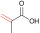
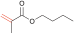
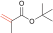
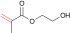
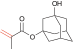
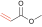
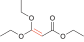
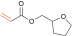

[README in English](./README.md)

# CopDDB

## 概要
このリポジトリは、量子化学計算によって得られたポリマーの伝搬反応に関するさまざまな記述子を集めたデータセットを配布するために作成されました。ポリマーに関する化学・情報科学コミュニティに役立つことを目指しています。

## データベースの内容
データセットは csv 形式で提供されており、化学反応に関する多様な記述子を含んでいます。([csv](./CopDDB/datasets/data/PropagationQuantumChem_2023-12-13.csv))
データセットに含まれる記述子は以下の通りです。

|記述子名|説明|
| --- | --- |
| Radical | ラジカル分子に対応する SMILES |
| Monomer | モノマー分子の対応する SMILES |
| ... | ... |

収集対象分子は以下の通りです。
| Monomer | CAS RN | Name | Abbreviation |
| --- | --- | --- | --- |
|  | 80-62-6 | Methyl methacrylate | MMA |
|  | 106-91-2 | Glycidyl methacrylate | GMA |
|  | 100-42-5 | Styrene | St |
|  | 5739-81-1 | Methyl (*Z*)-3-methoxyacrylate |
|   | 79-41-4 | Methacrylic acid |
|  | 97-63-2 | Ethyl methacrylate |
|  | 97-88-1 | Butyl methacrylate |
|  | 97-86-9 | Isobutyl methacrylate |
|  | 585-07-9 | *tert*-Butyl methacrylate
|  | 37674-57-0 | (3-Ethyloxetan-3-yl)methyl methacrylate | 
|  | 688-84-6 | 2-Ethylhexyl methacrylate |
|  | 142-90-5 | Dodecyl methacrylate |
|  | 32360-05-7 | Stearyl methacrylate |
|  | 101-43-9 | Cyclohexyl methacrylate |
|  | 2495-37-6 | Benzyl methacrylate |
|  | 868-77-9 | 2-Hydroxyethyl methacrylate |
|  | 923-26-2 | 2-Hydroxypropyl methacrylate |
|  | 115372-36-6 | 3-Hydroxy-1-methacryloyloxyadamantane |
|  | 115522-15-1 | 3,5-Dihydroxy-1-adamantyl methacrylate |
|  | 2867-47-2 |
|  | 105-16-8 |
|  | 34759-34-7 |
|  | 68586-19-6 |
|  | 2455-24-5 |
|  | 41988-14-1 |
|  | 2628-16-2 |
|  | 79-06-1 |
|  | 15214-89-8 |
|  | 79-10-7 |
|  | 96-33-3 |
|  | 93841-48-6 |
|  | 51952-49-9 |
|  | 5888-33-5 |
|  | 106-63-8 |
|  | 2499-59-4 |
|  | 216581-76-9 |
|  | 2478-10-6 |
|  | 86273-46-3 |
|  | 1663-39-4 |
|  | 65983-31-5 |
|  | 3121-61-7 |
|  | 2156-97-0 |
|  | 32002-24-7 |
|  | 23117-36-4 |
|  | 4813-57-4 |
|  | 2399-48-6 |
|  | 818-61-1 |
|  | 999-61-1 |
|  | 119692-59-0 |
|  | 48145-04-6 |

## 利用方法
このリポジトリには、csv ファイルの読み込みと処理を行うための Python モジュールも含まれています。Python 環境にて、このモジュールを利用することで、データセットを簡単に操作し分析を行うことができます。

### インストール方法
```sh
git clone https://github.com/hatanaka-lab/CopDDB
```

### 使用例 1. SMILES 文字列を使って記述子を取得する。
最も基本的な使い方は伝搬反応に関して集められた記述子を `dataset.QCValuesFromSMILES()` 関数を使って取得する方法です。以下の例はラジカルの SMILES `smi_rad` とモノマーの SMILES `smi_mon` を使って記述子を `pandas.DataFrame` の形で取得します。

```python
from CopDDB import datasets

smi_rad = "C=CC(=O)OCCCCCCCCCCCC"
smi_mon = "C=CC(=O)O"

features = datasets.QCValuesFromSMILES(smi_rad, smi_mon)
```
features を出力すると以下のようになります。
```
>>> print(features)
      DE_decomposition_tail  DE_decomposition_head  DE_precursor    DE_TS  ...  Real_theta  Volume_MonteCarlo_Mon  Volume_MonteCarlo_Rad  CCdist_TS
2078               0.042541               0.058434     -0.012791 -0.00314  ...   97.457318                54.3487                227.414   2.268076

[1 rows x 26 columns]
```

データセットに未記載の SMILES を入力すると空のデータフレームが返ってきます。エテン分子 `"C=C"` を使って試してみます。
```python
features = datasets.QCValuesFromSMILES("C=C", smi_mon)
```
features を出力すると以下のようになります。
```python
>>> print(features)
Empty DataFrame
Columns: [DE_decomposition_tail, DE_decomposition_head, DE_precursor, DE_TS, DE_product, DE_barrier, DE_reaction, DG_precursor, DG_TS, DG_product, DG_barrier, DG_reaction, E_Rad_SOMO, E_Rad_LUMO, E_Mon_HOMO, E_Mon_LUMO, DE_SHgap, DE_SLgap, VBur_R228_Mon, VBur_R350_Mon, VBur_R228_Rad, VBur_R350_Rad, Real_theta, Volume_MonteCarlo_Mon, Volume_MonteCarlo_Rad, CCdist_TS]
Index: []
```

欠損値を明示したい場合は `with_nan` (初期値は `False`) オプションを使って以下のようにします。
```python
features = datasets.QCValuesFromSMILES("C=C", smi_mon, with_nan=True)
```
features を出力すると以下のようになります。
```python
>>> print(features)
      DE_decomposition_tail  DE_decomposition_head  DE_precursor  DE_TS  ...  Real_theta  Volume_MonteCarlo_Mon  Volume_MonteCarlo_Rad  CCdist_TS
2500                    NaN                    NaN           NaN    NaN  ...         NaN                    NaN                    NaN        NaN

[1 rows x 26 columns]
```

戻り値に入力した SMILES を含ませる場合には `with_smiles` (初期値は `False`) を使います。
```python
features = datasets.QCValuesFromSMILES("C=C", smi_mon, with_nan=True, with_smiles=True)
```
features を出力すると以下のようになります。
```python
>>> print(features)
     Radical    Monomer  DE_decomposition_tail  DE_decomposition_head  ...  Real_theta  Volume_MonteCarlo_Mon  Volume_MonteCarlo_Rad  CCdist_TS
2500     C=C  C=CC(=O)O                    NaN                    NaN  ...         NaN                    NaN                    NaN        NaN

[1 rows x 28 columns]
```

SMILES は `list` 型で入力することもできます。`list` を用いることで複数の記述子を同時に取得できます。例えば、以下のように使います。
```python
smi_list = [
    ["C=C(C)C(=O)OC", "C=C(C)C(=O)OC"],
    ["C=C(C)C(=O)OC", "C=CC(=O)O"],
    ["CO/C=C\C(=O)OC", "C=Cc1ccccc1"]
]

features = datasets.QCValuesFromSMILES(smi_list)
```
features を出力すると以下のようになります。
```python
>>> print(features)
     DE_decomposition_tail  DE_decomposition_head  DE_precursor     DE_TS  ...  Real_theta  Volume_MonteCarlo_Mon  Volume_MonteCarlo_Rad  CCdist_TS
0                 0.038534               0.061518     -0.017766 -0.005547  ...  257.946990                79.4279               103.2494   2.254882
28                0.038534               0.061518     -0.004842  0.008555  ...   41.350879                54.3487               103.2494   2.248237
152               0.045085               0.045173     -0.014617 -0.003731  ...   33.562987                89.4457               103.2451   2.409667

[3 rows x 26 columns]
```

### 使用例 2. SMILES のリストと目的変数のリストからデータセットを作る (前処理)
この例では `datasets.buildVariablesFromSMILESandY()` 関数を使って SMILES 文字列と目的変数から、記述子と目的変数を含むデータセットを作ります。この関数は記述子に欠損値がある場合の欠損値の除去に便利です。作られるデータセットは `Bunch` オブジェクトで返されます。

```python 
from CopDDB import datasets

smi_list = [
    ["C=C(C)C(=O)OC", "C=C(C)C(=O)OC"],
    ["C=C(C)C(=O)OC", "C=CC(=O)O"],
    ["CO/C=C\C(=O)OC", "C=Cc1ccccc1"],
    ["C=C", "C=C"] # 欠損値になる SMILES ペア
]

target = [1, 2, 3, 4] # 目的変数

ds = datasets.buildVariablesFromSMILESandY(smi_list, target)
```
作られた `Bunch` オブジェクトは記述子 `data` と目的変数`target` を含みます。それぞれの中身を確認すると以下のようになります。
```python
>>> ds.keys()
dict_keys(['data', 'target'])

>>> print(ds["data"])
     DE_decomposition_tail  DE_decomposition_head  DE_precursor     DE_TS  ...  Real_theta  Volume_MonteCarlo_Mon  Volume_MonteCarlo_Rad  CCdist_TS
0                 0.038534               0.061518     -0.017766 -0.005547  ...  257.946990                79.4279               103.2494   2.254882
28                0.038534               0.061518     -0.004842  0.008555  ...   41.350879                54.3487               103.2494   2.248237
152               0.045085               0.045173     -0.014617 -0.003731  ...   33.562987                89.4457               103.2451   2.409667

[3 rows x 26 columns]

>>> print(ds["target"])
[1 2 3]
```

使用例 1 と同様に欠損値を明示したい場合は `with_nan` (初期値は `False`) オプションを使うことができます。
```python
>>> ds = datasets.buildVariablesFromSMILESandY(smi_list, target, with_nan=True)

>>> print(ds["data"])
      DE_decomposition_tail  DE_decomposition_head  DE_precursor     DE_TS  ...  Real_theta  Volume_MonteCarlo_Mon  Volume_MonteCarlo_Rad  CCdist_TS
0                  0.038534               0.061518     -0.017766 -0.005547  ...  257.946990                79.4279               103.2494   2.254882
28                 0.038534               0.061518     -0.004842  0.008555  ...   41.350879                54.3487               103.2494   2.248237
152                0.045085               0.045173     -0.014617 -0.003731  ...   33.562987                89.4457               103.2451   2.409667
2500                    NaN                    NaN           NaN       NaN  ...         NaN                    NaN                    NaN        NaN

[4 rows x 26 columns]

>>> print(ds["target"])
[1 2 3 4]
```

### 使用例 3. モノマーペアに関する記述子データセットの作成 (前処理)
この例では、二つの異なるモノマー $M_1$ と $M_2$ からなるコポリマーの記述子を生成する方法について説明します。これを行うには、`datasets.buildPairVariablesFromSMILESandY()` 関数を使用します。この関数は以下の式 1 と式 2 に関わる記述子を一緒に並べて新しい記述子のセットを作成します。

まず初めに、なぜ新たに記述子のセットを生成する必要があるのかを考えてみます。
$M_1$, $M_2$ が作るコポリマーの成長反応には以下の 4 種の素反応が関わります。

$$
M_1^* + M_1 \xrightarrow{k_{11}} M_1^* ~~~~(1)
$$

$$
M_1^* + M_2 \xrightarrow{k_{12}} M_2^* ~~~~(2)
$$

$$
M_2^* + M_1 \xrightarrow{k_{21}} M_1^* ~~~~(3)
$$

$$
M_2^* + M_2 \xrightarrow{k_{22}} M_2^* ~~~~(4)
$$

ここで、$M^*_1$、$M^*_2$ は $M_1$, $M_2$ それぞれのラジカルを示し、
$k_{ij}$ は $M^*_i$ と $M_j$ の反応速度定数を示しています。
CopDDB [ref1] の一つのレコードは式 1 から式 4 のどれか一つの情報を含みます。つまり、モノマー $M_1$、$M_2$ の反応を説明するには上の式を複数用いた方が実際の反応をよりよく説明できるようになるのです。

`datasets.buildPairVariablesFromSMILESandY()` 関数では CopDDB 内の記述子の末尾に、反応に関わる分子の番号を付加して新しい記述子にします。例えば、式 1, 2 について、記述子 **DE_TS** はそれぞれ **DE_TS_11**、**DE_TS_12** となります。ラジカル $M_i^*$ やモノマー $M_i$ のように単一の分子由来の記述子には分子の番号を一つだけ付けます。例えば、**E_Rad_SOMO** のように分子軌道エネルギーの記述子は **E_Rad_SOMO_1** となります。

このアイディアをもとにして、[ref1] では CopDDB の記述子を並べ直して記述子のセットを作り、それを用いて共重合で重要な意味を持つモノマー反応性比 $r_1$ の予想モデルを作成しました。

[ref1]: https://www.rsc.org/journals-books-databases/about-journals/digital-discovery/
